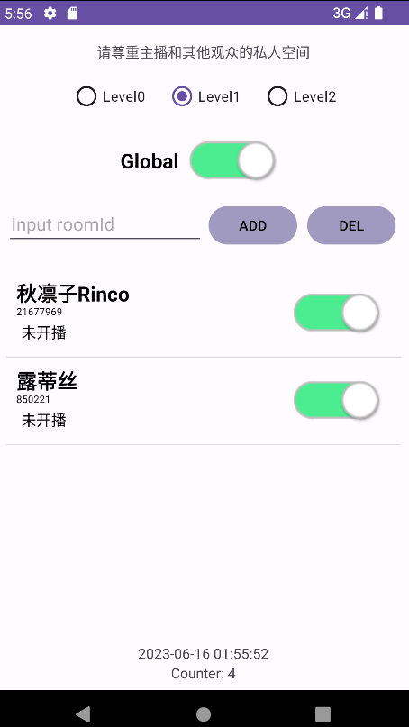

# AddictsClock

## 简介

+ Bilibili主播开播提醒闹钟

## 效果图

## 用户协议

+ 请尊重主播和其他观众的私人空间
+ 请对自己好一些

## 使用方法

+ 每隔1分钟测试所有目标直播间一次
+ 当有目标直播间开播时，播放《Starlight》
  + 音乐素材来源: BV1h34y1H7Q2
+ 连续5次因为网络问题测试失败时，播放《13》
  + 音乐素材来源: BV1WA411z7nR

#### 控件功能

+ 设置Android系统的休眠策略
  + Level0: 屏幕正常自动熄灭，在屏幕熄灭后程序停止
  + Level1: 在屏幕熄灭后程序继续运行（与手机的休眠策略有关，可能失效）
  + Level2: 保持屏幕不自动熄灭，在手动熄灭屏幕后程序停止
+ 全局开关Global
+ Input roomId: 输入目标直播间号
  + ADD: 根据直播间号添加房间（允许短号）
  + DEL: 根据直播间号删除房间（不允许短号）
+ 每个直播间的主播ID、直播间号、直播标题和局部开关
+ 上一次测试时的时间
+ 自Global打开以来测试的次数

## 说明

+ 因为本职不是做开发相关工作的，一边学习Android开发一边实现的该工具，很多代码不规范或不完善
+ 目前不打算对该项目的功能进行扩展，只会修复影响使用的bug
